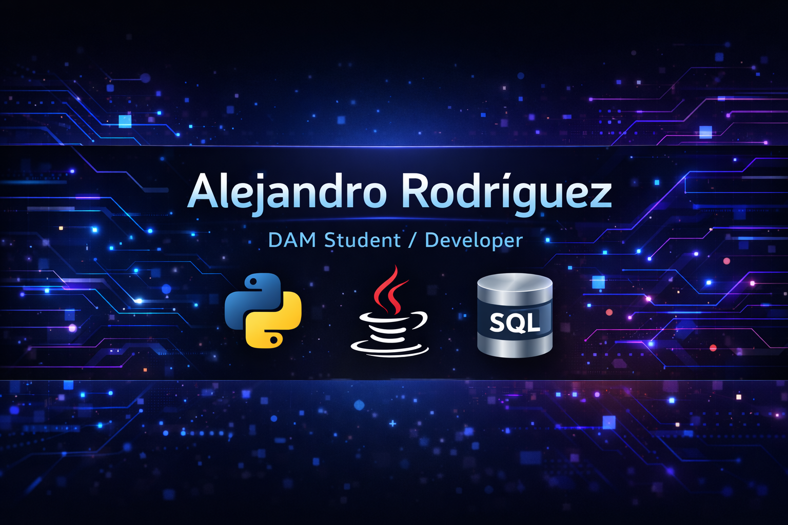

  

<h1 align="center">Hola, soy Alejandro Rodríguez 👋</h1>
<h3 align="center">💻 DAM Student | 🚀 Future Software Developer | 🇪🇸 Granada</h3>

  
  

---

## 🚀 Sobre mí

🎓 Estudiante de **Técnico Superior en Desarrollo de Aplicaciones Multiplataforma (DAM)**
💡 Apasionado por la **programación, bases de datos, IA y desarrollo de software**
📚 Aprendiendo cada día sobre **Python, Java, SQL y buenas prácticas**
🎯 Objetivo: convertirme en un desarrollador top y construir proyectos útiles y visuales

---

## 🎨 Tech Stack

  

---

## 📌 Proyectos Destacados

| 🚀 Proyecto            | 📖 Descripción                                      |
| ---------------------- | --------------------------------------------------- |
| ⚽ Liga de fútbol IA    | Base de datos limpia y visual de una liga inventada |
| 🧠 Automatizaciones IA | Scripts y herramientas con Python                   |
| 💻 Apps DAM            | Proyectos de clase bien estructurados               |

---

## 📈 Actividad

  

---

## 🌱 Actualmente

* 🔥 Mejorando lógica de programación
* ⚡ Creando proyectos para GitHub
* 🗄️ Aprendiendo bases de datos SQL
* 🤖 Explorando IA aplicada a proyectos

---

## 📫 Contacto

  📍 Granada, España • 📧 ar25746@gmail.com

---

  ✨ <b>Siempre aprendiendo, siempre mejorando.</b> ✨

